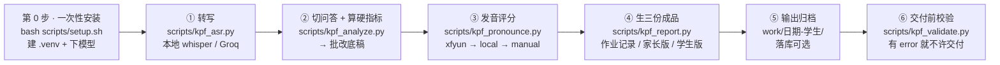

# kpf-speaking-grading

[](https://github.com/dongruiyue/kpf-speaking-grading/actions/workflows/ci.yml)

**把学生剑桥五级（KET / PET / FCE）口语作业的音频或视频丢进来，本机转写 → 按剑桥口径诊断 → 生成「作业记录 / 家长版反馈 / 学生版」三份成品 → 交付前用校验器把"合规"变成退出码。**

它是一套**给英语老师批口语作业的固定流程**：口径、数字和措辞每次都一样，不因批次而飘。干活的是一组 Python 脚本（可当纯命令行工具用），调度它们的是 `SKILL.md` 这份流程说明（agent skill 用法见文末）。

- 输入：`.m4a`、`.mp3`、`.wav`、`.mp4`、`.mov`（视频自动取音轨，**不需要 ffmpeg、不需要先转码**）
- 输出：三份 `.md` 成品 + 转写 JSON + 发音报告，落在 `work/<日期>-<学生>/`
- **机器做的**：转写、切问答、算硬指标、给发音分（调语音评测引擎）、生成成品骨架、交付前合规校验
- **人做的**：判断作业形态（自问自答 / 独白 / 对话）、要图片类题型的图、改措辞、决定互动交际

## 六步流程



第 ⑥ 步不是建议、是闸门：`kpf_validate.py` **有 error 就退出码 1**，逐条打印行号与原因。校验不通过就回去改报告，不是改校验器。

## 它能解决什么

一个班 5 个学生各交一页口语作业（学生念题 + 自己回答，约 140 秒的音频或视频），老师要出：

- 5 份**内部作业记录**（分项评分、硬指标、逐项详评、抽听点位表）
- 5 份**家长版反馈**（纯文字，能直接粘到微信）
- 5 份**学生版反馈**（逐句修改表 + 升级表达）

这套流程把可机检的部分全部做完：音频 → 转写 → 切出每题问答 → 算出语速 / 停顿 / 词数 → 调语音评测引擎给发音分 → 生成三份成品骨架 → 逐份校验。老师只做两件机器做不了的事：**按形态判断哪几项有证据**、**把骨架改成自己的话**。

耗时参考（8GB M2、CPU int8，实测）：一页 5 题约 140 秒的录音，**转写约 47 秒**（`large-v3-turbo`，约 3 倍实时），转写 + 分析全流程约 1 分钟。数据出处：`references/06-verification.md` 第五节。

## 文档地图

| 想知道什么 | 去哪里 |
|---|---|
| 怎么装、怎么跑、每个参数什么意思 | 本文件（下面「完整工作流」） |
| **对外讲解**：原理 / 机制 / 用法 / 与人工对比 / 待改进项，含 15 分钟讲稿骨架与十二条预判问答 | `docs/explainer/`（从它的 `README.md` 进） |
| agent 的流程导航、能力边界、常见坑 | `SKILL.md` |
| 评分细则：题型地图、量表、证据等级、反馈模板、自检清单 | `references/` |
| 准确度账：校准方法、四轮盲判结果、样本边界 | `docs/calibration.md` |
| 讯飞语音评测的开通步骤与报错排查 | `docs/xfyun-setup.md` |

## 设计约束（为什么它长这样）

这几条是硬约束，不是偏好；`scripts/check_consistency.py` 会盯着它们不许漂移：

1. **AI 只负责两项**：「语法与词汇」「话语组织」。
2. **发音不许 AI 编**：分数只来自语音评测引擎（讯飞 ISE）；引擎不可用时标 `待教师填`。AI 顶多产出带时间戳的"抽听点位表"。
3. **独自录音 / 自问自答不评「互动交际」**：没有对手方就没有证据，只能标 `N/A` 或「待补」。给一个分就是编。
4. **A2 Key 只有 3 个维度**（语法与词汇、发音、互动交际），**没有话语组织**；B1 Preliminary / B2 First 是 4 项。
5. **单篇作业只给分项分**（每个维度 `X / 5`，允许半分），**不给加权总分、不给得分率、不判过没过**；只有覆盖全部 Part、四项齐备的**完整模拟**才给总分。官方分制：A2 Key 各项 ×2 + Global Achievement ×3 = 45；B1 ×1 + GA ×2 = 30；B2 ×2 + GA ×4 = 60。
6. **家长版有硬红线**：放官方口径的分项分，但**不放引擎原始分**（如 `93.6/100`）、**不放带量化的技术指标**（语速 X 词/分、停顿 X 次、词数）；不出现 `AI / 引擎 / 评测 / 讯飞 / 识别 / 转写 / 数据` 这些字眼；纯文字不用表格。理由很直白：家长不该看出有工具链参与，他看到的必须是"老师自己听出来的"。
7. **防编造**：家长版引用的学生原句必须能在转写稿里找到，相似度 **< 0.85 直接判 error**。

## 能力边界（先说做不到的）

| 你要的 | 为什么不行 | 怎么办 |
|---|---|---|
| 批**写作 / 笔试**作业 | 这套维度只对口语有效 | 另找作文批改流程 |
| 评**互动交际**，但录音里只有学生一个人（自问自答 / 独白） | 没有对手方就没有证据，给分就是编 | 标 `N/A` 或「待补」；要真评就另排一次两两对话 |
| 只有**文字稿**、没有音频 | 发音维度无从下手，连疑点定位都做不了 | 只评语法与词汇、话语组织；发音标「待补」并说明原因 |
| 要**预测官方考试成绩**（总分、能不能过、考几分证书） | 口语只占考试一部分，官方明确说原始分不能预测真实考试分数 | 明说无法预测；只在覆盖全部 Part 的完整模拟里给**参考判定** |
| 要**判断是不是本人说的**（排除作弊） | 不做声纹或身份判断 | 说明做不到，交老师处理 |
| 要**替考官定档、发证书式结论** | 教学口径的 0–5 不是官方考官分 | 标清「AI 预估 / 教学映射」，说明不等于官方分 |

完整清单在 `SKILL.md` 的「何时使用」；"哪些维度有证据"的矩阵在 `references/01-task-map.md` 第三节。

## 安装（一次性）

```bash
bash scripts/setup.sh
```

- 需要 **`uv`**（`brew install uv`）。脚本会建 `.venv`、装依赖、**预下载 faster-whisper 模型 `large-v3-turbo`（首次约 1.6GB）**。
- 默认走国内镜像 `HF_ENDPOINT=https://hf-mirror.com`，并自动绕过系统代理（macOS 系统代理指向未启动的程序时会阻断下载）。有科学上网时用 `KPF_HF_ENDPOINT= bash scripts/setup.sh` 直连。
- **模型只认 `large-v3-turbo` 或更大**：实测 `tiny` 对学习者语音的识别质量不足以支撑题目对齐（对齐度 0%）。

### 可选：API key（不配也能跑）

```bash
mkdir -p ~/.kpf-speaking
cp config.example.json ~/.kpf-speaking/config.json   # 然后编辑填空
make doctor                                          # 离线自检：凭证齐不齐、发音分从哪来、下一步跑什么
```

> 讯飞那一部分是**唯一需要你去控制台动手的**：注册 → 实名认证 → 建应用 → **开通「语音评测suntone」**
> → 抄 `APPID / APIKey / APISecret`。逐步指引、报错对照表、额度怎么省：**`docs/xfyun-setup.md`**。

| 块 | 用途 | 说明 |
|---|---|---|
| `xfyun` | **发音分首选**（讯飞 ISE 语音评测） | 免信用卡、免代理、有免费额度。**要你先在控制台「开通」服务**（不开通接口直接报错），再填 `appid / api_key / api_secret`。评的是**念题部分**，所以跑的时候**必须给 `--questions questions/<页号>.txt`**。完整步骤见 `docs/xfyun-setup.md` |
| `groq_api_key` | 云端转写加速 | 秒级出稿，但**学生音频会上传** |

**所有 key 都可以留空。** 缺了会按 provider 链自动降级（xfyun → local → manual），并在 stderr 打印每一步降级原因——**不会静默给 0 分**。代价是家长版里的发音分需要老师手填。

`config.example.json` 里还有一个可选的 `vault` 块：只在你想把成品顺手落进自己的笔记库时才需要（库根目录 + 产物→目录映射，见 `references/05-output-and-vault.md` 第二节）。不填也能用，三份成品照旧落在 `work/<日期>-<学生>/`。

## 离线可跑的演示（不需要音频、不需要任何 key）

下面三条命令在本仓库直接跑，输出是**实跑结果**（下方 `make check` 输出里的绝对路径已替换为 `<repo>`，其余逐字照抄）。

### 1. `make check`——发布前必跑的四道闸门

```bash
$ make check
python3 -m py_compile scripts/check_consistency.py scripts/check_publishable.py scripts/kpf_analyze.py scripts/kpf_anonymize.py scripts/kpf_asr.py scripts/kpf_calibrate.py scripts/kpf_doctor.py scripts/kpf_ise_stream.py scripts/kpf_pronounce.py scripts/kpf_report.py scripts/kpf_validate.py scripts/kpf_xfyun.py tests/run_fixtures.py
python3 scripts/check_consistency.py
KPF 规则一致性校验 · <repo>

[1] to_band() 阈值
  ✅ to_band() 阈值一致：代码 BANDS=[(90, 5), (80, 4), (70, 3), (60, 2), (0, 1)] ↔ 02-rubric 5.3=[('ge', 90), ('ge', 80), ('ge', 70), ('ge', 60), ('lt', 60)]

[2] 各级别口语满分
  ✅ 02-rubric 官方分制表一致：A2 Key 45 / B1 Preliminary 30 / B2 First 60
  ✅ 各级别满分（45 / 30 / 60）在代码与文档里没有矛盾配对

[3] A2 Key 维度数
  ✅ 01-task-map.md 维度矩阵：A2 列明确没有「话语组织」
  ✅ 01-task-map.md 逐级维度数正确：A2 3 项（语法与词汇、发音、互动交际）；B1 4 项（语法与词汇、话语组织、发音、互动交际）；B2 4 项（语法与词汇、话语组织、发音、互动交际）
  ✅ 02-rubric.md 的 A2 维度行正确：语法与词汇、发音、互动交际（3 项，无话语组织）
  ✅ kpf_report.py 三个报告模板都存在，核心维度行齐备

[4] 引用完整性
  ✅ 引用完整性：SKILL.md + references/*.md 里 129 处 scripts/references/questions 路径全部存在

[5] 自我覆盖残留
  ✅ 无自我覆盖残留：没有「取代此前 / 效力高于 / 优先于本文件 / 已作废 / 本节的效力」

[6] references 节号连续
  ✅ references 一级节号全部连续（## 一、## 二、…）

[7] 防编造阈值（QUOTE_ERROR / QUOTE_PASS）
  ✅ 防编造阈值一致：QUOTE_ERROR=0.85 / QUOTE_PASS=0.92（代码 ↔ 06-verification §8.4 ↔ checklist/04-feedback）

[8] 家长版技术指标分级（停顿 / 语速带量化才算指标）
  ✅ 家长版技术指标分级一致：无条件 7 个；带数字才算 ['个词']；带量化才算 ['停顿', '语速']；数据/样本/测量仍在禁用词里

[9] 维度中英对照与 A2 例外说明
  ✅ 维度中英对照一致：4 组（A2 Key 3 项、无话语组织，kpf_report.py 三套模板都有 A2 例外说明）

[10] 02-rubric 四节档位表结构（张数 / 6 档 / 偶数档与 0 档口径）
  ✅ 02-rubric 档位表结构一致：11 张表 × 6 档，偶数档=相邻两档混合、0 档=低于 1 档

一致性校验通过：14 项断言全部成立
python3 tests/run_fixtures.py
夹具回归 · 33 个用例 · 校验器 scripts/kpf_validate.py
夹具目录 <repo>/tests/fixtures
期望表   <repo>/tests/expected.json

用例                                 kind/form/level    退出码  error  warning  结果
------------------------------------------------------------------------------------
parent_fail_banned_word.md           家长/单篇/FCE           1      1        0  PASS
parent_fail_core_pending.md          家长/单篇/FCE           1      1        0  PASS
parent_fail_duplicate_dim.md         家长/单篇/FCE           1      1        0  PASS
parent_fail_fabricated.md            家长/单篇/FCE           1      1        0  PASS
parent_fail_ket_discourse.md         家长/单篇/KET           1      1        0  PASS
parent_fail_ket_discourse_en.md      家长/单篇/KET           1      1        0  PASS
parent_fail_metrics.md               家长/单篇/FCE           1     25        3  PASS
parent_fail_missing_section.md       家长/单篇/FCE           1      1        1  PASS
parent_fail_no_transcript.md         家长/单篇/FCE           1      1        0  PASS
parent_fail_pause_quantified.md      家长/单篇/FCE           1      2        0  PASS
parent_fail_solo_interaction.md      家长/单篇/FCE           1      1        0  PASS
parent_fail_speed_quantified.md      家长/单篇/FCE           1      1        0  PASS
parent_fail_total_score.md           家长/单篇/FCE           1      1        0  PASS
parent_pass_fce.md                   家长/单篇/FCE           0      0        0  PASS
parent_pass_fce_en_dims.md           家长/单篇/FCE           0      0        0  PASS
parent_pass_ket.md                   家长/单篇/KET           0      0        0  PASS
parent_pass_mock_fce.md              家长/完整模拟/FCE       0      0        0  PASS
parent_pass_total_exempt.md          家长/单篇/FCE           0      0        0  PASS
parent_quote_fabricated.md           家长/单篇/FCE           1      1        0  PASS
parent_quote_missing_word.md         家长/单篇/FCE           0      0        1  PASS
parent_quote_punctuation.md          家长/单篇/FCE           0      0        0  PASS
parent_quote_swapped_word.md         家长/单篇/FCE           1      1        0  PASS
parent_quote_verbatim.md             家长/单篇/FCE           0      0        0  PASS
parent_warn_missing_soft_section.md  家长/单篇/FCE           0      0        1  PASS
parent_warn_pause_unquantified.md    家长/单篇/FCE           0      0        1  PASS
parent_warn_speed_unquantified.md    家长/单篇/FCE           0      0        1  PASS
record_draft.md                      作业记录/单篇/FCE       0      0       23  PASS
record_draft_via_flag.md             作业记录/单篇/FCE       0      0       23  PASS
record_fail_draft_removed.md         作业记录/单篇/FCE       1     23        0  PASS
record_pass.md                       作业记录/单篇/FCE       0      0        0  PASS
record_pass_dim_table.md             作业记录/单篇/FCE       0      0        0  PASS
record_pass_ket.md                   作业记录/单篇/KET       0      0        0  PASS
student_pass.md                      学生/单篇/FCE           0      0        0  PASS
------------------------------------------------------------------------------------

全绿：33/33 个用例与期望表一致（退出码 + error/warning 计数）
python3 scripts/check_publishable.py
发布闸门 · <repo>
黑名单 publishable-denylist.txt（10 条）· 命中就逐条列在下面

提示：`.venv/` 没有被 git 跟踪（已确认）

可发布：0 处命中（扫了 84 个文本文件）
```

**退出码 0。** 全程离线、不需要任何 API key、秒级跑完——所以 CI 里也只跑这一条（`.github/workflows/ci.yml`），不用装 faster-whisper 那类重依赖。

> 「提示：`.venv/` 没有被 git 跟踪（已确认）」是发布闸门第 5 项检查（`.venv/` 有没有被 git 跟踪）的输出。本仓库自己就是 git 仓库，所以这一项会真跑；哪天 `.venv/` 被误 `git add`，这里会变成一条 FAIL，并指认第一个被跟踪的文件。

### 2. 合规的家长版 → `PASS`

```bash
$ python3 scripts/kpf_validate.py tests/fixtures/parent_pass_fce.md --kind 家长 --form 单篇 --level FCE --no-transcript-check
PASS 家长/单篇/B2 First · tests/fixtures/parent_pass_fce.md · 0 error / 0 warning（未做防编造检查：--no-transcript-check）
$ echo $?
0
```

> 这条演示用的是公开夹具，仓库里没有配套的转写稿，所以显式加了 `--no-transcript-check`——
> **不带这个开关、又不给 `--transcript`，家长版直接判 error**（只有同一份夹具在
> `tests/fixtures/parent_fail_no_transcript.md` 里演示这条规则）。摘要行末尾那句
> 「未做防编造检查」就是这个开关留下的痕迹：**"没检查"不能看起来像"检查通过"**。

### 3. 踩了红线的家长版 → `FAIL`，逐条打行号

```bash
$ python3 scripts/kpf_validate.py tests/fixtures/parent_fail_metrics.md --kind 家长 --form 单篇 --level FCE --no-transcript-check
全文 [warning] 未写「六、本次未涉及的部分」段（家长版固定六段结构）
全文 [warning] 未找到家长版的「存在的问题」段（固定六段结构）
全文 [warning] 未找到家长版的「需要改进的方向」段（固定六段结构）
校验未通过：tests/fixtures/parent_fail_metrics.md（家长/单篇/B2 First）
  L7 [error] 残留占位符「〔具体表扬，引原话或数字〕」：交付前必须填完
  L7 [error] 残留占位符「〔结构上的具体表扬〕」：交付前必须填完
  L7 [error] 残留占位符「〔内容/配合度〕」：交付前必须填完
  L11 [error] 残留占位符「〔问题的一句话说明，必须带证据〕」：交付前必须填完
  L11 [error] 残留占位符「〔可执行动作〕」：交付前必须填完
  L13 [error] 残留占位符「〔同上〕」：交付前必须填完
  L15 [error] 残留占位符「〔如需第三条，务必是前两条之外、且同样有证据的〕」：交付前必须填完
  L17 [error] 残留占位符「〔每天几分钟做什么，说明不用发给老师〕」：交付前必须填完
  L19 [error] 残留占位符「〔一句话理由：写稿会让"按词往外蹦"的习惯更重〕」：交付前必须填完
  L21 [error] 残留占位符「〔可验证的短期目标〕」：交付前必须填完
  L5 [error] 家长版出现技术指标「词/分」：家长版只放官方口径的 X / 5 分项分
  L5 [error] 家长版出现技术指标「词/分钟」：家长版只放官方口径的 X / 5 分项分
  L5 [error] 家长版出现技术指标「平均每题」：家长版只放官方口径的 X / 5 分项分
  L5 [error] 家长版出现技术指标「个词（词数统计）」：家长版只放官方口径的 X / 5 分项分
  L5 [error] 家长版出现带量化的技术指标「停顿」：家长版只放官方口径的 X / 5 分项分（把数字/次数删掉）
  L5 [error] 家长版出现带量化的技术指标「语速」：家长版只放官方口径的 X / 5 分项分（把数字/次数删掉）
  L23 [error] 家长版出现技术指标「词/分」：家长版只放官方口径的 X / 5 分项分
  L23 [error] 家长版出现技术指标「词/分钟」：家长版只放官方口径的 X / 5 分项分
  L23 [error] 家长版出现带量化的技术指标「语速」：家长版只放官方口径的 X / 5 分项分（把数字/次数删掉）
  L23 [error] 家长版出现引擎原始分「93.6/100」：只放官方口径的分项分 X / 5
全文 [error] 缺少「一、本次评分」段：家长版六段结构的第一段必须有（references/04-feedback.md 2.2）
全文 [error] 缺少免责句，必须一字不改：「这是单次录音的表现，不作为考试总分预估」
全文 [error] 缺少维度行「语法与词汇」（B2 First 必须有这几项：语法与词汇、话语组织、发音、互动交际）
全文 [error] 缺少维度行「话语组织」（B2 First 必须有这几项：语法与词汇、话语组织、发音、互动交际）
全文 [error] 缺少维度行「互动交际」（B2 First 必须有这几项：语法与词汇、话语组织、发音、互动交际）
FAIL 家长/单篇/B2 First · tests/fixtures/parent_fail_metrics.md · 25 error / 3 warning（未做防编造检查：--no-transcript-check）
$ echo $?
1
```

（`tests/fixtures/parent_pass_fce.md` 与 `parent_fail_metrics.md` 都是**匿名合成夹具**，不是真实学生数据。）

再试一个更贴近"防编造"的（报告里引一句转写稿里没有的学生原句）：

```bash
$ python3 scripts/kpf_validate.py tests/fixtures/parent_fail_fabricated.md --kind 家长 --form 单篇 --level FCE \
    --transcript tests/fixtures/_transcript.json
校验未通过：tests/fixtures/parent_fail_fabricated.md（家长/单篇/B2 First）
  L26 [error] 引用的学生原句在转写稿中找不到（原文引用，最相近片段相似度 0.50 < 阈值 0.85）：「I have visited three different cities with my cousin」——疑似编造，必须回音频/转写核对后再交付
FAIL 家长/单篇/B2 First · tests/fixtures/parent_fail_fabricated.md · 1 error / 0 warning
$ echo $?
1
```

## 完整工作流（第 1–6 步）

工作目录约定 `work/<日期>-<学生>/`：中间产物（底稿、发音报告、转写 JSON）与三份成品放一起，一次批改一个目录。

| 步骤 | 命令 | 需要你的音频吗 | 需要 API key 吗 |
|---|---|---|---|
| ① 转写 | `kpf_asr.py` | ✅ 需要 | ❌ `--engine local` 不需要 |
| ② 切问答 + 指标 | `kpf_analyze.py` | ❌ 纯离线 | ❌ |
| ③ 发音评分 | `kpf_pronounce.py` | ✅ 需要（切音频给评测接口） | ⚠️ 讯飞需要；local/manual 不需要 |
| ④ 生三份成品 | `kpf_report.py` | ❌ 纯离线 | ❌ |
| ⑤ 归档（落库可选） | 无脚本，按约定放目录 | ❌ | ❌ |
| ⑥ 交付前校验 | `kpf_validate.py` | ❌ 纯离线 | ❌ |

```bash
# ① 转写（本地引擎：免费无限，音频不出本机）
.venv/bin/python scripts/kpf_asr.py transcribe <音频或文件夹> \
    --student <学生> --class <班级> --level FCE --engine local --out work/<日期>-<学生>/
# → work/<日期>-<学生>/<文件名>--local.json

# ①′ 可选：交叉验证发音疑点（同一个文件跑第二遍 Groq，然后比对）
.venv/bin/python scripts/kpf_asr.py transcribe <音频> --engine groq --out work/<日期>-<学生>/
.venv/bin/python scripts/kpf_asr.py crosscheck \
    work/<日期>-<学生>/<文件名>--local.json work/<日期>-<学生>/<文件名>--groq.json \
    --out work/<日期>-<学生>/交叉验证.md
# 注意：crosscheck 只接受**恰好 2 个** json 文件，多给会 argparse 报错

# ② 切问答 + 算硬指标 + 出批改底稿
.venv/bin/python scripts/kpf_analyze.py work/<日期>-<学生>/<文件名>--local.json \
    --questions questions/FCE-P1-P102-holidays.txt \
    --student <学生> --class <班级> --level FCE \
    --out work/<日期>-<学生>/<学生>-底稿.md

# ③ 发音评分（auto = 讯飞 → 本地疑点 → 教师人工，任一成功即用）
.venv/bin/python scripts/kpf_pronounce.py work/<日期>-<学生>/<文件名>--local.json \
    --provider auto --questions questions/FCE-P1-P102-holidays.txt \
    --out work/<日期>-<学生>/<学生>-发音.md

# ④ 生三份成品（三份都要跑一遍；--form 决定互动交际的措辞）
.venv/bin/python scripts/kpf_report.py <底稿.md> --kind 作业记录 --form 自问自答 \
    --homework "<作业名>" --date <YYYY-MM-DD> --out work/<日期>-<学生>/<学生>-作业记录.md
.venv/bin/python scripts/kpf_report.py <底稿.md> --kind 家长 --form 自问自答 \
    --homework "<作业名>" --date <YYYY-MM-DD> --out work/<日期>-<学生>/<学生>-家长.md
.venv/bin/python scripts/kpf_report.py <底稿.md> --kind 学生 --form 自问自答 \
    --homework "<作业名>" --date <YYYY-MM-DD> --out work/<日期>-<学生>/<学生>-学生.md

# ⑤ 归档：三份成品 + 底稿 + 发音报告 + 转写 JSON 都留在同一个作业目录；
#    （可选）把成品归进自己的笔记库，见 references/05-output-and-vault.md 第二节

# ⑥ 交付前必须跑，三份都跑（有 error 就重做报告，不是改校验器）
#    家长版与学生版**必须**给 --transcript —— 防编造是交付红线，不给就等于这项没跑过（详见 ⑥′）
python3 scripts/kpf_validate.py work/<日期>-<学生>/<学生>-家长.md --kind 家长 --form 单篇 --level FCE \
    --transcript work/<日期>-<学生>/<文件名>--local.json
python3 scripts/kpf_validate.py work/<日期>-<学生>/<学生>-学生.md --kind 学生 --form 单篇 --level FCE \
    --transcript work/<日期>-<学生>/<文件名>--local.json
python3 scripts/kpf_validate.py work/<日期>-<学生>/<学生>-作业记录.md --kind 作业记录 --form 单篇 --level FCE

# ⑥′ 防编造：报告里引用的学生原句必须在转写稿里找得到（相似度 < 0.85 → error）。
#     转写稿拿不出来时，必须加 --no-transcript-check 显式承认"本次未做这项检查"，
#     否则家长版/学生版直接判 error —— 不让"忘了加参数"变成一条静默放行的红线。
python3 scripts/kpf_validate.py work/<日期>-<学生>/<学生>-家长.md --kind 家长 --form 单篇 --level FCE \
    --transcript work/<日期>-<学生>/<文件名>--local.json \
    [--quote-threshold 0.85] [--quote-warn-threshold 0.92]
```

几个 `--form` 与 `--draft` 的用法要点：

- `--form` 取 `自问自答` / `独白` / `对话`。不给就留 `〔待判断〕` 占位符等你填；**含对手方的对话录音绝不能被写成"自问自答"**。
- 作业记录可以先落**草稿形态**（frontmatter `状态: 草稿`，或校验时加 `--draft`）：占位符残留从 error 降为 warning，其余检查不变。**填完占位符、转正式、重跑为 0 error 才算可交付**；家长版 / 学生版没有草稿形态（传 `--draft` 是用法错误，退出码 2）。
- 校验器**只用 Python 标准库**：用系统 `python3` 跑即可，不必进 `.venv`、不联网、不用凭证。转写 / 发音那两步才需要 `.venv`。

## 「准不准」：已验证什么、还没验证什么

**这一节请当必读。** 唯一权威状态表是 `references/06-verification.md`——本仓库刻意把"没验证的"和"验证过的"分开列，README 只做摘要，冲突时以那份文件为准。

### 已经真实录音跑通（学生甲，FCE，P102，`.mov`，140.4 秒）

| 能力 | 结论 |
|---|---|
| 本地转写直接读视频容器 | ✅ 自动提音轨，**不需要 ffmpeg、不需要先转码** |
| `large-v3-turbo` 正式效果 | ✅ 140.4 秒音频 **47 秒转完**（约 3 倍实时），216 词全部带词级置信度 |
| 统一 schema | ✅ 本地 / Groq / 外部转写稿输出同一结构，可互换、可交叉比对 |
| 题目对齐（含念错题） | ✅ 验收标准是**逐题答词数相对人工基线的偏差 ≤5%**（不是"能切出 5 题"就算过）；`Which` 念成 `We each`、漏读 `in` 都被抓到 |
| 指标口径 | ✅ 外部转写服务：145 词 / 每题 29.0（手工基线 143 / 28.6，偏差 1.4%） |
| 双引擎交叉验证 | ✅ 自动标出 `00:18.2` 为高置信疑点，与人工听音判断的位置一致 |
| **讯飞 ISE 语音评测** | ✅ 5 句念题实测通过（含 overall / 发音 / 韵律 / **句末语调** / 语速与逐词逐音素得分），耗时 8.4 秒；顺带抓到"特殊疑问句念成升调"这种纯人工听音容易漏的问题 |
| **两个讯飞引擎的差异** | ✅ 同一段录音：suntone 总分 79.6（映射 3 档）vs 流式版 61.3（映射 2 档）——**差 18.3 分、差两档**，所以只作主评分 + 质检分工，绝不混用 |
| 合规校验器与一致性断言 | ✅ 31 个夹具 + 14 项断言，`make check` 全绿（就是上面第 1 条演示） |

### 尚未验证（`references/06-verification.md` 第四节原样照搬；其中「真人校准」已做四轮盲判复测——只有两轮真盲，覆盖率仍不足）

- ⬜ **Groq 引擎**：代码已实现（`verbose_json` + `timestamp_granularities[]=word`），**未用真实 key 跑过**。注意免费层单文件 25MB 上限。
- 🟡 **真人校准：已做四轮盲判复测，但只有两轮是真盲——对外基线是「真盲第四轮」18.8%，`1.0.0` 的门槛仍未达。** 外部真值用的是**剑桥官方发布的公开样题视频 + 配套官方给分文件**（公开视频，考官真实给分），6 个 case（FCE 两位 + KET 两位 + PET 两位考生）、**16 个可比维度点**（发音点一律是 AI 缺值，不计）。**四轮对照**（同一批语料，只换"用哪版 rubric"与"判官知不知道官方分"）：

  | 轮次 | 是否真盲 | 完全一致 | ±1 档 | 平均带符号差 |
  |---|---|---|---|---|
  | 盲判一（旧 rubric） | **真盲** | 2/16 = 12.5% | 14/16 = 87.5% | −0.88 |
  | 盲判二（+5 档锚点） | **污染（量表泄漏答案）** | 6/16 = 37.5% | 15/16 = 93.8% | −0.34 |
  | 盲判三（+中段修正） | **污染（量表泄漏答案）** | 8/16 = 50.0% | 16/16 = 100.0% | −0.06 |
  | **盲判四（现行 rubric · 净化版量表）** | **真盲** | **3/16 = 18.8%** | **15/16 = 93.8%** | **−0.47** |

  **关键：第 2、3 轮并不真盲**——那两轮判官要读的量表里当时写着官方分与历轮结果（判官读到量表就读到了答案），所以**那个 37.5% 与那个 50.0%（以及被泄漏撑起来的 −0.06）作废**：不作基线、不作 rubric 效果的证据，只当"泄漏能把数字撑到多高"的记录。**唯一可比的改进对比是「真盲一 ↔ 真盲四」**：完全一致 **12.5% → 18.8%**、±1 档 **87.5% → 93.8%**、偏差 **−0.88 → −0.47**——**但这一对只能读出"本轮复测指标有改善"，读不出"那两处改动确实有效"**（四个真盲轮每轮只有一个判官实例、而且互不相同，"改动起效"与"这一轮判官手松/手紧"分不开）。**第四轮逐点**（官方 → 盲判四；A–F 是六位考生的匿名代号，A / B / E / F 有话语组织，C / D 属 A2）：A 语法 −0.5 / 话语 −0.5 / 互动 0；B +0.5 / +0.5 / 0；C −1 / −1.5；D −0.5 / −1；E −0.5 / −0.5 / −0.5；F −1 / −1 / 0——**唯一掉出 ±1 档的是 C 的互动交际（官方 5 → 3.5）**，而 C / D 正是 A2。**口径敏感**：剔掉 A2 那 2 个证据不足的互动交际点（纯转写看不到考官提示了几次、沉默了多久）后，±1 档从 93.8% 变 **100.0%**、偏差 **−0.47 → −0.36**；**剔掉全部互动交际后，完全一致率是 0/10**——三个"完全一致"的点**全部来自互动交际**，而 **AI 真正负责的语法与词汇 + 话语组织是 0/10 完全一致**（8 点偏 −0.5、2 点偏 −1.0，只有 B 的语法与词汇是 +0.5）。**残余偏差仍有方向**（A / D / E / F 多为 −0.5、B 为 +0.5，整体 −0.47）：**仍然偏严，只是比 −0.88 好了一半**——**不是"已无系统性偏差"**。所以**此前公布的 8/10 = 80%（4 case 版本）与 14/16 = 87.5%（6 case 版本）都应视为被锚定高估**，非盲那一组的 87.5% 同样只作锚定效应的对照，都不得再作为结论。**三组口径的复算命令见 `docs/calibration.md` 的「证据口径敏感性」。**

  **一条工具边界**：**A2 的互动交际在纯转写里基本测不到**——A2 的判据只有"能不能维持简单交流 / 需要多少提示与支持"，而切分后的文本里看不到考官提示了几次、沉默了多久；上面 C 的 −1.5 很可能主要是**证据缺失**，不是判错。所以只有纯转写时，A2 的互动交际宜标「待补」、或明确标注为「推断」。

  **三条限制**：① **每轮只有一个判官实例（四个真盲轮是四个不同实例）**——12.5% → 18.8% 这一路里"rubric 改动起效"与"这一轮判官手松些"分不开，n = 1 只能看方向、不能当精度指标；② **语料没变**（同 6 条 case 反复用，多轮 = 同语料换 rubric 重判，不是多批独立样本）；③ **低档（0–2）与发音维度仍然零覆盖**（16 点全落在 3–5 档，发音 6 点全是 AI 缺值）。**读这几个数字必须同时看四个边界**：① **样本严重偏上**——16 个官方分点**全部落在 3–5 档**、**0 个**落在 0/1/2 档，而作者实际带的学生多在 1–3 档，**低档（0–2）没有任何外部验证**；② **语法与词汇另有已识别的转写偏差，方向与幅度都未测量** —— 本机 whisper 会自动把学习者的错误改对（实测：官方评语引用的原句含三处错误，转写把它们改成了正确形式），所以转写比真实口语更正确，它对一致率的影响**可能美化、也可能加大偏差**；③ **发音维度仍是 0 校准**——这些是对话考试，朗读型的讯飞 ISE 必须有参考文本、用不上，发音点全是"AI 缺值"；④ **锚定效应已实测**——同一批语料，知道 vs 不知道官方分，完全一致率 **87.5%（非盲）vs 12.5%（真盲一轮）/ 18.8%（真盲四轮）**（二、三轮的 37.5% / 50.0% 是污染数字，不作证据），所以判档必须在看官方分之前完成，**而且判官读的那份量表必须已经抹掉校准数字**（先只拿语料判档、写 `ai-分项.json`，判完再写 `teacher.json`，用隔离目录 + 姓名替换 + 保留文件 mtime 留证）。**还有一条：绿灯 ≠ 判分可用**——`±1 档` 的 80% 门槛太松，真盲一轮偏低 0.88 档、`|差| ≥ 1 档` 11 条却仍然算"绿灯"；真盲四轮同样是绿灯（15/16 = 93.8% ≥ 80%），而完全一致率只有 **18.8%**，**完全一致率与系统性偏差才是主指标**。**结论：真盲一 → 四 的改进有限（完全一致率 12.5% → 18.8%、偏差 −0.88 → −0.47），且 n = 1、语料未换，仍只是方向性证据；低档与发音维度都没覆盖，`1.0.0` 的门槛仍未达**（门槛是 ≥5 个真实 case 且低档也有真值）。做法见 `docs/calibration.md`，带名字的完整报告留在仓库外。
- ⬜ **模糊对齐的容差**：逐题词数有 **±2–4 词**的边界误差；验收标准定在"逐题答词数相对人工基线偏差 ≤5%"，整体量级可靠，**单题词数只当近似值**。

还有一条使用上的坑，写在这里免得踩：**同一个学生的跨批次对比（尤其"改正版 vs 原版"的进步曲线）必须用同一个引擎**——不同引擎的答题总词数差 8%、停顿数差 67%（本地 whisper 的停顿系统性偏少），绝对数字不可跨引擎比。

## 持续性怎么保证

**每次改规则都不许靠"我觉得"**，靠四个东西：

```bash
python3 scripts/check_consistency.py     # 规则本身有没有漂移（14 项断言）
python3 tests/run_fixtures.py            # 匿名夹具的退出码与 error/warning 计数
python3 scripts/check_publishable.py     # 发布闸门：真实姓名 / 个人路径 / 凭证 / 音视频名
```

这三条（再加上语法级的 `py_compile`，共四条）就是 `make check` 的四道闸门——各自的退出码非零即红，也是 `make check` 的退出码。另外两个工具负责"越用越准"：

| 工具 | 干什么 | 判据 |
|---|---|---|
| `scripts/kpf_calibrate.py` | 把 **AI 分项分**与**真人老师给分**比对：逐维度完全一致率、**±1 档一致率**、系统性偏差、混淆矩阵、分歧清单（老师理由 + AI 当时引的证据）。`--exclude 级别:维度`（可重复）把**证据不足的点**剔出统计，并在报告里**逐点列出**剔了哪些、不会静默丢 | **±1 档一致率低于 `--min-agreement`（默认 0.8）→ 退出码 1**；进入统计的 case 少于 3 个时只当"冒烟" |
| `scripts/kpf_anonymize.py` | 把真实 case 变成**可公开的夹具**：替换姓名 / 班号 / 绝对路径 / 音视频文件名，**保留英文原句与分数** | 写完自动复扫产物，有残留 → 退出码 1 |

这两件事的完整闭环（语料怎么攒、报告怎么读、怎么把一批真实样本变成规则改动与回归夹具）写在 **`docs/calibration.md`**。

## 隐私与合规

**默认路径上，学生的音频不出本机。**

- 默认转写引擎是**本机跑**的 faster-whisper（`--engine local`）：不联网、不上传、免费无限。这是刻意选的默认值。
- 一旦改用 **Groq**（`--engine groq`），**学生音频会上传到第三方服务**；发音评测（讯飞 ISE）同样需要把切好的音频片上传。要自己权衡——**涉及未成年人时，尤其要注意先取得家长同意**。
- 仓库里**所有测试夹具都是合成的**，不含任何真实学生数据；姓名一律是「学生甲 / 学生乙」这类代号，班号一律是 `FCE-A` 这类形式。
- **建议：真实学生的音频、转写、姓名永远不要提交到任何 git 仓库。** 仓库侧的兜底有两道——`.gitignore` 已忽略 `work/`、音视频后缀与 `*.local.json`；`make check` 里的发布闸门会扫真实姓名（黑名单）、个人绝对路径、凭证形态与音视频文件名，命中就 exit 1。`git add` 之前跑一次 `make check`。
- 凭证只放 `~/.kpf-speaking/config.json`（仓库外，已 `.gitignore`），示例值一律留空。

## 版权

`questions/` 下的 10 条题干出自 Cambridge《FCE Trainer》Test 1 / Test 2 的 Speaking Part 1（P56 音乐、P102 假期），**版权归 Cambridge University Press & Assessment**，本仓库仅作**格式示例**、不主张任何权利。详情与自建题库格式见 `questions/README.md`。

**要公开发布又不想带真题，一条命令摘除：**

```bash
bash scripts/strip-copyright-content.sh --dry-run   # 先看会改什么
bash scripts/strip-copyright-content.sh            # 删掉 questions/*.txt，并生成 questions/example.txt 占位
```

它会删掉 `questions/*.txt`（保留 `questions/README.md`）、把文档里指向这些文件的路径统一改成 `questions/example.txt`、生成占位题库，并在结束时列出还需手工检查的地方（示例命令、机械替换留下的重复等）。**幂等，跑两次不会出错。**

## 许可

- **代码**（`scripts/**`、`tests/**`）：MIT，见 [`LICENSE`](LICENSE)。
- **文档**（`SKILL.md`、`README.md`、`references/**`、`docs/**` 等）：CC BY 4.0，见 [`LICENSE-docs.md`](LICENSE-docs.md)（署名即可、可自由改编；官方条款：<https://creativecommons.org/licenses/by/4.0/>）。
- 第三方版权材料（`questions/` 下的真题题干）不在上述许可范围内。

## 贡献

改规则、改阈值之前请先读 [`CONTRIBUTING.md`](CONTRIBUTING.md)，那里有两条硬纪律：

1. **不许"追加新章节 + 声明效力更高"式打补丁**——必须物理删除旧段落、节号重排连续（这个项目曾经因此攒出 14 处自相矛盾）。
2. **改了任何阈值/数值，必须同时改 `references/06-verification.md` §8.4 的锚点表**——`check_consistency.py` 从那张表反解数值去比对代码，改一处就是漂移。

「越用越准」的路径见 [`docs/calibration.md`](docs/calibration.md)。

## 作为 agent skill 使用

`SKILL.md` 是给 Claude Code / Codex 这类 agent 读的流程入口（frontmatter 里的 `name` / `description` 决定它什么时候被触发）。它只做流程导航，细则全在 `references/`：

| 文件 | 什么时候读 |
|---|---|
| `references/01-task-map.md` | 每次批改开头：确认题型与哪几个维度有证据 |
| `references/02-rubric.md` | 打分前：各维度锚点、官方分制、单篇/完整模拟口径（**跨文件冲突的最终裁定**） |
| `references/03-scoring-rules.md` | 判断证据等级、处理转写失真、决定哪些必须人工 |
| `references/04-feedback.md` | 写家长版 / 学生版之前（家长版红线以它第二节为唯一口径） |
| `references/checklist.md` | 报告写完、交付前：全 skill 唯一一份自检清单 |
| `references/05-output-and-vault.md` | 输出归档与（可选）落库 |
| `references/06-verification.md` | 脚本改动后、或怀疑某环节不准时：**实测结论与已知坑** |

也可以完全离开 agent 用：`scripts/` 下的脚本都是普通命令行工具，`references/` 就是一份可打印的教学 SOP。
